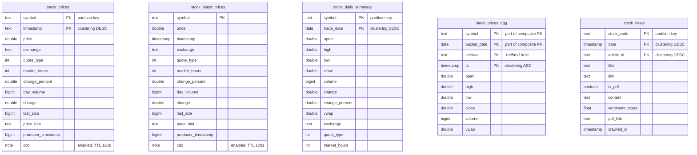
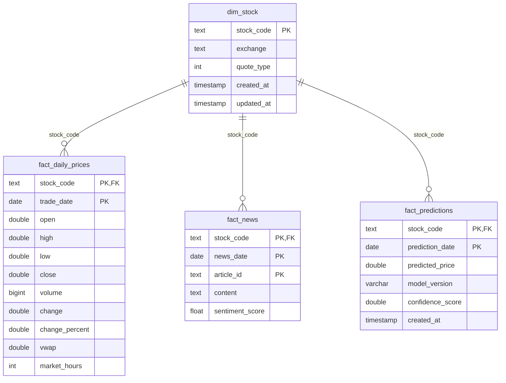
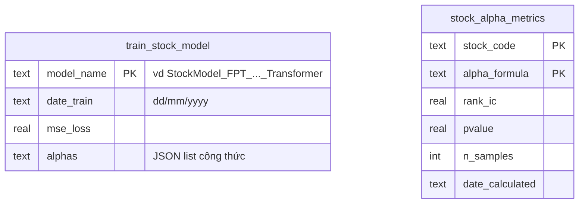
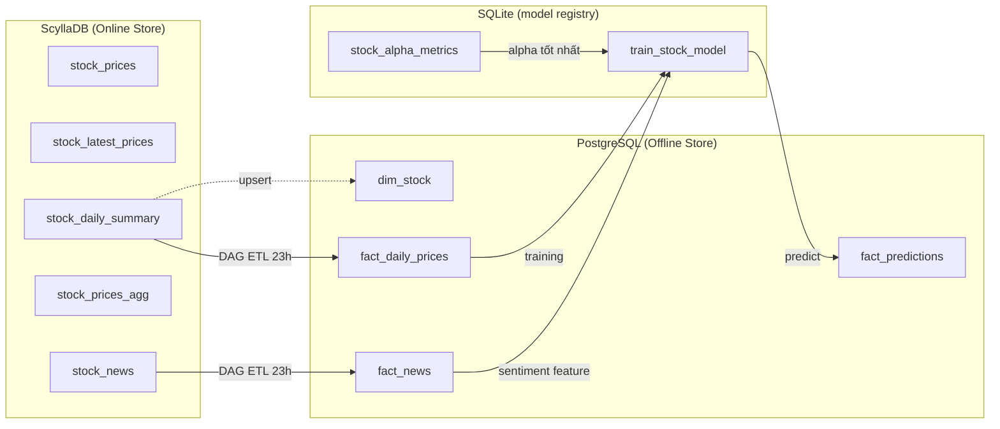

# Database Schema — Stock Market Platform

Hệ thống dùng **3 database** ở 3 vai trò khác nhau.

---

## 1. ScyllaDB — `stock_data` (Online Store / kho nóng)

> NoSQL, không có khóa ngoại. Các bảng liên kết logic qua `symbol`. Ghi chú PK/Clustering & CDC.

---

## 2. PostgreSQL — `warehouse` (Offline Store / Star Schema)

> Có khóa ngoại thật. `dim_stock` là dimension, 3 bảng `fact_*` là fact.

---

## 3. SQLite — `stock_models.db` (Model registry, trong stock-prediction)

> Lưu lịch sử training & alpha. Liên kết logic qua mã cổ phiếu (nằm trong `model_name` / `stock_code`).

---

## Liên kết giữa 3 database (luồng dữ liệu)

